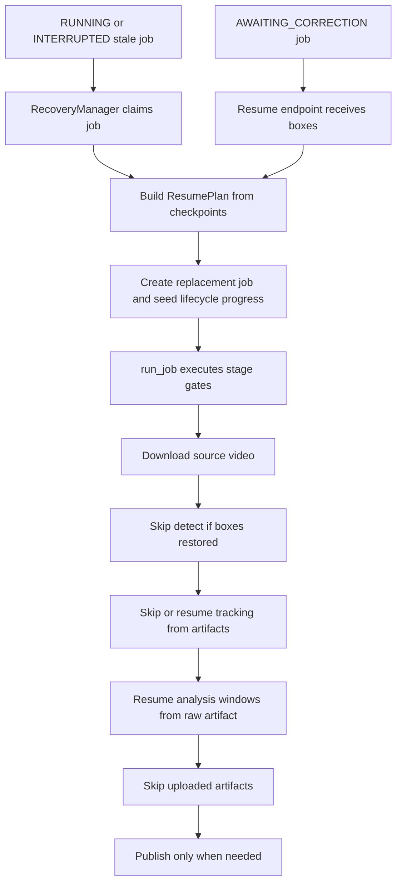

# Worker Recovery Checkpoints

## Current Diagnosis

`/Users/stanliu/Documents/whole-video-analysis/service/worker.py` already writes most V1 checkpoint builders; they are not broadly unused anymore. Existing durable writes include download completion, initial detection pending, periodic track progress, mid-track loss, track completion, upscale/analyze start and window progress, annotate completion, incremental upload, and terminal publish.

The bigger problem is on the resume side: `/Users/stanliu/Documents/whole-video-analysis/service/routes.py` rebuilds replacement requests with `build_resume_overrides(checkpoints)`, and `/Users/stanliu/Documents/whole-video-analysis/service/worker.py` only applies that through `resume_from_frame`, `resume_tracking_s3_key`, and analysis fields. That skips initial detection when boxes exist and can resume mid-track from partial JSON, but it does not reliably jump over all completed stages.

Key gaps found:

- New replacement jobs can regress persisted progress because `run_job` starts by writing download/detect/track progress like 2%, 10%, and 15% even when the lifecycle was seeded from a 55% or 67.5% checkpoint.
- `build_resume_overrides` ignores a completed `track.artifacts.tracking_s3_key` unless an `upscale_analyze` checkpoint also has `analysis_raw_s3_key`, so a crash after tracking upload can still re-run tracking.
- The `END_OF_TRACKING_SENTINEL` path is fragile: `run_job` passes the sentinel into `run_tracking_job`, and `tracking_pipeline/hybrid_tracking.py` still tries to read that frame. The worker should skip tracking before calling the tracker.
- Late-stage checkpoints (`annotate`, `upload`, `publish`) are written, but recovery does not use them to skip already-uploaded artifacts or mark already-published/completed work.
- Cancellation/early returns in `worker.py` do not always write a final V1 cancellation/progress checkpoint; the `finally` block may upload partial tracking JSON to S3, but it does not write the corresponding checkpoint row.
- Periodic partial tracking uploads read the streaming `tracking.json`; the tracker writes incrementally, but the writer should flush before worker-side checkpoint reads so uploaded partials are current.
- The detect-skip path with supplied boxes writes lifecycle progress but no detect/verified-box checkpoint from the worker itself.

## Target Flow

## Implementation Plan

1. Add a deterministic resume reader in `/Users/stanliu/Documents/whole-video-analysis/service/checkpoints.py`.

Create a small `ResumePlan` or equivalent helper on top of the existing builders. It should inspect `STAGE_ORDER`, collect artifacts from `track`, `upscale_analyze`, `annotate`, `upload`, and `publish`, and return explicit decisions such as `skip_detect`, `skip_tracking`, `resume_tracking_s3_key`, `resume_analysis_from_raw`, `uploaded_artifacts`, and `terminal_completed`. Keep `build_resume_overrides` as the compatibility wrapper if needed, but make both manual resume and automatic recovery use the same source of truth.

2. Fix checkpoint insertion gaps in `/Users/stanliu/Documents/whole-video-analysis/service/worker.py` and `/Users/stanliu/Documents/whole-video-analysis/tracking_pipeline/hybrid_tracking.py`.

Keep the existing stage-boundary writes, then add or tighten these points:

- After boxes are accepted on the detect-skip path, write a detect/verified checkpoint instead of only lifecycle progress.
- At tracking start, write a lightweight tracking-start checkpoint for progress visibility.
- During tracking, make partial checkpoint uploads reliable by flushing the streaming `tracking.json` before reads, writing an immediate first partial checkpoint once usable tracking data exists, and continuing the 30-second cadence.
- On cancellation/failure, if `finally` saves `partial_tracking.json`, also write a `track_progress` or cancellation checkpoint pointing at it.
- For no-analysis/upscale-only paths, write a clear `upscale_analyze` completion/progress checkpoint rather than leaving only `analysis_started`.
- Preserve the existing annotate/upload/publish checkpoint writes, but make sure their artifacts are sufficient for the resume reader to skip repeated uploads.

3. Make `run_job` actually jump to the durable resume point.

Before each expensive stage, check the resume plan/request fields and gate the stage:

- Always allow source-video download for now; source-video caching can stay deferred.
- Do not write lower lifecycle progress than the seeded replacement progress.
- Skip detection when boxes are restored, and record that checkpoint.
- If a full or partial tracking artifact exists and the plan says tracking is complete, download it to the local `tracking.json` path and bypass `run_tracking_job`; do not pass `END_OF_TRACKING_SENTINEL` into `hybrid_tracking.run_tracking`.
- If a partial tracking artifact exists and tracking is not complete, download/merge it and start from `resume_from_frame`.
- If `analysis_raw_s3_key` exists, let `_run_upscale_analysis` resume from the raw analysis cursor, but use the request-provided context/window count as fallback when the raw artifact is incomplete.
- If upload artifacts already exist, skip re-uploading those exact artifacts and continue from the first missing one.
- If a terminal publish checkpoint already exists for a stale lifecycle row, reconcile should mark the job completed or avoid spawning duplicate work.

4. Align manual resume and automatic recovery in `/Users/stanliu/Documents/whole-video-analysis/service/routes.py` and `/Users/stanliu/Documents/whole-video-analysis/service/reconciler.py`.

Keep the intended split: `AWAITING_CORRECTION` is resumed manually with boxes; stale `RUNNING`/`INTERRUPTED` jobs are recovered automatically. Both paths should build replacement requests from the same `ResumePlan`, seed lifecycle progress from `worker_state`, write the old-job `replaced_by_new_job` terminal checkpoint, and never create a replacement that starts by lowering progress.

5. Add tests that simulate crash points instead of only checkpoint shapes.

Add focused tests in `/Users/stanliu/Documents/whole-video-analysis/tests/test_checkpoint_schema.py`, `/Users/stanliu/Documents/whole-video-analysis/tests/test_worker_checkpoints.py`, and `/Users/stanliu/Documents/whole-video-analysis/tests/test_resume_endpoint.py` for:

- Crash after download/detect, after first tracking partial, after track upload, during analysis, after analysis upload, after annotated-video upload, and after publish checkpoint.
- Manual mid-track correction resumes with boxes plus `partial_tracking_s3_key` and `resume_from_frame`.
- Recovery with full `tracking_s3_key` skips `run_tracking_job` entirely.
- Recovery with `analysis_raw_s3_key` does not call the tracker with the sentinel.
- Replacement lifecycle progress never regresses below the old `worker_state.progress_percent`.
- Cancellation/failure partial uploads also have a checkpoint row.

## Acceptance Criteria

- Every durable worker checkpoint write uses the V1 envelope with `worker_state`.
- A crash at any post-checkpoint stage can recover with bounded rework only: at most since the last tracking partial or analysis flush, not from the beginning.
- Initial and mid-track detection-required jobs remain `AWAITING_CORRECTION` until manual resume, then replacement jobs skip already-completed work.
- Automatic recovery never passes the sentinel frame into the tracking pipeline.
- Progress shown through lifecycle/SSE never drops when a replacement job starts.