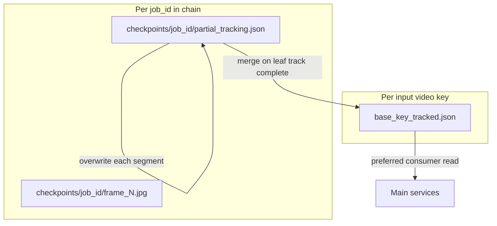

# Tracking JSON S3 artifacts — consumer handoff

**Date:** 2026-05-23  
**Status:** contract — vision engine (`whole-video-analysis`) + `video_analysis_and_annotation_service`  
**Audience:** Agents and backend services that read athlete boxes, pose keypoints, and frame metadata from S3 after hybrid tracking.

---

## 1. Purpose

This document explains how to **locate, resolve, and parse** frame-indexed tracking JSON produced by the BJJ vision engine.

**In scope**

- Final and partial tracking JSON in S3 (`*_tracked.json`, `partial_tracking.json`)
- JSON schema: boxes, COCO-17 keypoints, joint scores, frame state
- How **one video** can span a **chain of `job_id`s** and which object is canonical

**Out of scope** (see §8)

- `track_response.json` (job ACK only: `job_id`, `status`)
- `{base_key}_analysis.json` (Gemini technique timeline, not per-frame pose)
- Pre-track `detections.json` / `verified_boxes.json` (initialization only)

**Related contracts**

- [JOB_ROTATION_HANDOFF_AND_RESUME.md](./JOB_ROTATION_HANDOFF_AND_RESUME.md) — `job_id` rotation, `video_analysis_latest_job`, `replacement_job_id`
- [CHECKPOINT_ARTIFACTS_V1_ADDENDUM.md](./CHECKPOINT_ARTIFACTS_V1_ADDENDUM.md) — checkpoint `artifacts.*` keys that point at S3 objects

---

## 2. S3 keys and buckets

### 2.1 Key patterns

| Artifact | S3 key | Scope | When to use |
|----------|--------|-------|-------------|
| **Final tracking JSON** | `{base_key}_tracked.json` | Per **input video key** | **Default read** for boxes/keypoints |
| Partial tracking | `checkpoints/{job_id}/partial_tracking.json` | Per `job_id` | Resume/debug only; may be incomplete |
| Detection frame JPEG | `checkpoints/{job_id}/frame_{frame_idx}.jpg` | Per `job_id` | Human-in-the-loop UI (not pose data) |

Where:

```text
base_key = os.path.splitext(TrackRequest.key)[0]
```

**Example:** input video key `videos/match.mp4` → tracking JSON at `videos/match_tracked.json`.

### 2.2 Bucket

Use `TrackRequest.output_bucket` when set; otherwise `TrackRequest.bucket`. The worker uploads to the same bucket for partials and the final `{base_key}_tracked.json` (`service/worker.py`).

### 2.3 Canonical vs per-job flow



- **Consumers should prefer `{base_key}_tracked.json`** once the leaf job has finished the track stage (and chain merge, if any).
- **Do not** treat an arbitrary job’s `partial_tracking.json` as full video history (see §3.4).

---

## 3. Resolving the correct JSON for one video

A single uploaded video may go through **multiple `job_id`s** (manual resume after detection correction, automatic crash recovery, mid-track handoff). Each replacement creates a new row in `job_lifecycle` linked by `parent_job_id` / `replacement_job_id`.

### 3.1 Normative consumer algorithm

1. **Resolve active `job_id`**
   - If you have `video_id`: read `video_analysis_latest_job` → `job_id`.
   - Follow [JOB_ROTATION_HANDOFF_AND_RESUME.md](./JOB_ROTATION_HANDOFF_AND_RESUME.md): after handoff, poll **`job_lifecycle` for the new `job_id`**, not the superseded one.
   - If an old row has `replacement_job_id` set, the active work is on that successor.

2. **Preferred artifact**
   - From stored job params (`job_request_params.request_json` or equivalent), get `key` (input video S3 key) and bucket.
   - Compute `base_key` and download **`s3://{bucket}/{base_key}_tracked.json`**.

3. **If final JSON is missing** (job still tracking, or upload not done yet)
   - Load **all** `job_stage_checkpoints` for the **leaf** `job_id`.
   - Resolve S3 keys (newest-first; terminal `replaced_by_new_job` rows often omit keys):
     - Prefer newest `artifacts.tracking_s3_key` → usually `{base_key}_tracked.json`
     - Else newest `artifacts.partial_tracking_s3_key` → `checkpoints/{job_id}/partial_tracking.json`
   - Logic mirrors `resolve_best_tracking_keys_from_checkpoints` in `service/tracking_chain_merge.py`.

4. **Multi-job merged history**
   - Before upscale, the **leaf** worker runs `consolidate_tracking_json_with_job_chain`:
     - Walks `parent_job_id` from leaf → root
     - Downloads each ancestor’s best full or partial JSON
     - Merges `frames[]` with **last writer wins** on duplicate `frame_idx` (order: root ancestor → … → parent → current local file)
     - Uploads a single `{base_key}_tracked.json`
   - **Consumers should not manually merge partials** unless implementing their own recovery; use the leaf’s final upload.

### 3.2 Checkpoint pointers (leaf job)

| Checkpoint field | Points to |
|------------------|-----------|
| `artifacts.tracking_s3_key` | `{base_key}_tracked.json` (after track upload) |
| `artifacts.partial_tracking_s3_key` | `checkpoints/{job_id}/partial_tracking.json` |
| `artifacts.resume_from_frame` | Next global frame index to process (absolute, not 1-based UI counter) |

See [CHECKPOINT_ARTIFACTS_V1_ADDENDUM.md](./CHECKPOINT_ARTIFACTS_V1_ADDENDUM.md) § `stage_name == track`.

### 3.3 Resume routing (why you might see partial vs full)

`build_resume_plan` (used by manual resume and recovery):

1. If upscale checkpoint has `analysis_raw_s3_key` → tracking is done; use `tracking_s3_key` from upscale checkpoint, skip re-tracking.
2. Else if any checkpoint has full `tracking_s3_key` → skip re-tracking.
3. Else → mid-track resume from `partial_tracking_s3_key` + `resume_from_frame`.

For **reading consumer data**, prefer full `tracking_s3_key` over partial when both exist in history.

### 3.4 Pitfalls

| Pitfall | Detail |
|---------|--------|
| **Partial overwrite** | Each tracking segment uploads `partial_tracking.json` with mode `"w"`, replacing the previous object for that `job_id`. Mid-handoff partials are often **tail-only**. |
| **Stale `job_id`** | Progress and SSE move to the **replacement** job after `POST /jobs/{id}/resume`. |
| **`video_analysis_latest_job.job_state`** | Not always fresh for `RUNNING`; read `job_lifecycle` for the resolved `job_id`. |
| **Schema name drift** | [API.md](../../API.md) uses `frames[].frame`; S3 pipeline JSON uses `frames[].frame_idx` (§4). |

---

## 4. JSON schema (pipeline / S3 truth)

**Source of truth:** `tracking_pipeline/hybrid_tracking.py` (`_append_frame_to_json`, `_build_athlete_dicts`). The worker uploads this shape to S3 without normalizing to the API.md variant.

### 4.1 Root object

| Field | Type | Description |
|-------|------|-------------|
| `video` | string | Source video path or name |
| `fps` | number | Video frames per second |
| `start_frame` | integer | Global start frame of this tracking run/clip; may be updated after chain merge |
| `end_frame` | integer | Global end frame (exclusive or segment boundary per run) |
| `frames` | array | Per-frame records (**sparse** — see §4.4) |

### 4.2 Per frame (`frames[]`)

| Field | Type | Description |
|-------|------|-------------|
| `frame_idx` | integer | **Global** video frame index — use for lookups, not array position |
| `local_idx` | integer | Index relative to segment `start_frame` |
| `timestamp` | number | Seconds: `round(frame_idx / fps, 4)` |
| `state` | string | Tracking state machine value (§4.3) |
| `iou` | number | Inter-athlete mask IoU, 4 decimal places |
| `athletes` | array | Typically 0–2 athlete objects |

### 4.3 `state` values

From `tracking_pipeline/state_machine.py`:

| Value | Meaning (high level) |
|-------|----------------------|
| `TRACKING` | Normal propagation |
| `SCRAMBLE` | High overlap between athletes |
| `LOST` | Track lost |
| `RE_ID_MODE` | Re-identification active |
| `FADING_OUT` | Transition toward blackout |
| `BLACKOUT` | Scene blackout |
| `RECOVERING` | Recovering from blackout |

### 4.4 Per athlete (`frames[].athletes[]`)

| Field | Type | Required | Description |
|-------|------|----------|-------------|
| `track_id` | integer | yes | Display ID (1 or 2 after identity mapping) |
| `box` | `[x1, y1, x2, y2]` | yes | Axis-aligned bbox, full-frame coords, rounded to 1 decimal |
| `source` | string | yes | Box origin, e.g. `"SAM2"` |
| `keypoints` | `[[x, y], ...]` length 17 | no | COCO-17 pose in full-frame space; omitted in fast mode or when pose disabled |
| `keypoint_scores` | `[float, ...]` length 17 | no | Per-joint confidence when pose enabled |

**Segmentation masks** are not stored in JSON (only in annotated video output).

### 4.5 COCO-17 keypoint index map

| Index | Joint |
|-------|--------|
| 0 | nose |
| 1 | left eye |
| 2 | right eye |
| 3 | left ear |
| 4 | right ear |
| 5 | left shoulder |
| 6 | right shoulder |
| 7 | left elbow |
| 8 | right elbow |
| 9 | left wrist |
| 10 | right wrist |
| 11 | left hip |
| 12 | right hip |
| 13 | left knee |
| 14 | right knee |
| 15 | left ankle |
| 16 | right ankle |

### 4.6 Confidence and quality signals

| Data | Where to read it |
|------|------------------|
| Per-joint pose confidence | `frames[i].athletes[j].keypoint_scores[k]` |
| Frame-level tracking quality | `frames[i].iou`, `frames[i].state` |
| YOLO detection confidence | **Not** in final tracking JSON |

For detection confidence (human-in-the-loop or pre-track):

- Checkpoint: `pending_detection.candidates[].confidence`
- Pre-track file: `detections.json` → `persons[].confidence`

### 4.7 Frame stride (sparse `frames[]`)

Only frames with `global_idx % frame_stride == 0` are written to JSON (`TrackRequest.frame_stride` / `step_size`). SAM2 still propagates every frame internally; consumers must not assume `frames[]` is dense.

To query frame `F`:

- Exact hit: find entry where `frame_idx == F`
- Otherwise: use largest `frame_idx <= F` in the array, or interpolate in your service

### 4.8 Schema drift vs API.md

[API.md](../../API.md) documents a **normalized** shape for the standalone analysis API:

| Pipeline (S3) | API.md normalized |
|---------------|-------------------|
| `frames[].frame_idx` | `frames[].frame` |
| includes `state`, `iou`, `source`, `local_idx` | omitted |

The vision engine worker and upscale path use **`frame_idx`**. Optional normalizer: `service/tracking_runner.normalize_tracking_output()` (not applied on upload today).

---

## 5. Sample data

### 5.1 Minimal example (copy-paste)

```json
{
  "video": "videos/example_match.mp4",
  "fps": 30.0,
  "start_frame": 0,
  "end_frame": 12,
  "frames": [
    {
      "frame_idx": 0,
      "local_idx": 0,
      "timestamp": 0.0,
      "state": "TRACKING",
      "iou": 0.12,
      "athletes": [
        {
          "track_id": 1,
          "box": [120.5, 80.0, 420.3, 510.7],
          "source": "SAM2",
          "keypoints": [
            [270.0, 95.0], [255.0, 90.0], [285.0, 90.0],
            [240.0, 98.0], [300.0, 98.0], [220.0, 140.0],
            [320.0, 140.0], [200.0, 200.0], [340.0, 200.0],
            [190.0, 260.0], [350.0, 260.0], [230.0, 300.0],
            [310.0, 300.0], [225.0, 380.0], [315.0, 380.0],
            [220.0, 470.0], [320.0, 470.0]
          ],
          "keypoint_scores": [
            0.92, 0.88, 0.87, 0.75, 0.74, 0.91, 0.90,
            0.85, 0.84, 0.80, 0.79, 0.88, 0.87, 0.83,
            0.82, 0.78, 0.77
          ]
        },
        {
          "track_id": 2,
          "box": [480.0, 100.0, 780.0, 520.0],
          "source": "SAM2",
          "keypoints": [
            [630.0, 115.0], [615.0, 110.0], [645.0, 110.0],
            [600.0, 118.0], [660.0, 118.0], [580.0, 160.0],
            [680.0, 160.0], [560.0, 220.0], [700.0, 220.0],
            [550.0, 280.0], [710.0, 280.0], [590.0, 320.0],
            [670.0, 320.0], [585.0, 400.0], [675.0, 400.0],
            [580.0, 490.0], [680.0, 490.0]
          ],
          "keypoint_scores": [
            0.90, 0.86, 0.85, 0.72, 0.71, 0.89, 0.88,
            0.82, 0.81, 0.77, 0.76, 0.86, 0.85, 0.80,
            0.79, 0.75, 0.74
          ]
        }
      ]
    },
    {
      "frame_idx": 6,
      "local_idx": 6,
      "timestamp": 0.2,
      "state": "SCRAMBLE",
      "iou": 0.71,
      "athletes": [
        {
          "track_id": 1,
          "box": [125.0, 82.0, 425.0, 512.0],
          "source": "SAM2"
        },
        {
          "track_id": 2,
          "box": [475.0, 98.0, 775.0, 518.0],
          "source": "SAM2"
        }
      ]
    }
  ]
}
```

Note: second frame omits `keypoints` / `keypoint_scores` to show optional fields (e.g. fast mode or pose skip on that frame).

---

## 6. Agent recipes

### 6.1 Bounding boxes at frame F

```text
1. Load {base_key}_tracked.json from S3 (or resolved partial fallback).
2. Find frames[] entry where frame_idx == F (or nearest <= F if strided).
3. For each athletes[] entry: box is [x1, y1, x2, y2], track_id is stable athlete label.
```

### 6.2 Skeleton for track_id T at frame F

```text
1. Same frame lookup as §6.1.
2. Find athletes[] where track_id == T.
3. If keypoints present: 17 pairs [x, y] in full-frame pixels.
4. If keypoint_scores present: gate joints (engine smoothing uses min_confidence ≈ 0.3).
5. If keypoints absent: pose not recorded for that frame (do not infer from box alone).
```

### 6.3 Map track_id to “athlete A / B”

`track_id` 1 and 2 are **display labels** after identity mapping, not raw SAM internal IDs. Initial `box_a` / `box_b` from the track request seed which physical person becomes 1 vs 2. After scrambles, the engine may swap display labels (`identity_manager`).

### 6.4 After job handoff

When `POST /jobs/{job_id}/resume` returns a **new** `job_id`:

- Switch polling, SSE (`GET /jobs/{new_job_id}/events`), and checkpoint reads to the new id.
- Re-fetch `{base_key}_tracked.json` only after the leaf job completes the track stage (or use partial + checkpoint keys while running).

### 6.5 Pseudocode: resolve S3 key from leaf job

```python
def resolve_tracking_s3_key(checkpoints: list[dict]) -> tuple[str | None, str | None]:
    """Returns (full_tracked_key, partial_key). Newest artifact-bearing row wins."""
  # Prefer tracking_s3_key from track / upload / upscale_analyze stages (newest first)
  # Else partial_tracking_s3_key from track stage (newest first)
  # See service/tracking_chain_merge.resolve_best_tracking_keys_from_checkpoints
```

---

## 7. Related artifacts (not tracking JSON)

| Artifact | S3 key pattern | Contents |
|----------|----------------|----------|
| Analysis output | `{base_key}_analysis.json` | `clips[]` with technique labels, `confidence` per clip — not per-frame pose |
| Annotated video | `{base_key}_annotated.mp4` | Rendered overlays |
| Job ACK | N/A (HTTP response) | `{ "job_id", "status" }`; subscribe to the Keyspaces-backed SSE stream for progress |
| Pre-track detections | local / checkpoint-adjacent | `detections.json`, `verified_boxes.json` |
| Checkpoint envelope | Keyspaces JSON | Wraps `artifacts.*`; not the tracking body itself |

---

## 8. Implementation references

| Component | Path |
|-----------|------|
| JSON writer | `tracking_pipeline/hybrid_tracking.py` |
| S3 upload / partial cadence | `service/worker.py` |
| Chain merge | `service/tracking_chain_merge.py` |
| Checkpoint builders | `service/checkpoints.py` |
| Resume / handoff routes | `service/routes.py` |
| Optional normalizer | `service/tracking_runner.normalize_tracking_output` |

---

## Changelog

| Date | Change |
|------|--------|
| 2026-05-23 | Initial consumer handoff doc |
